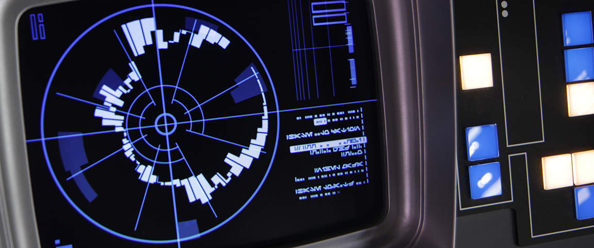

# CS 231129

Combining this sketch with the setup of a new sveltekit repo.
Inspiration from a Rogue One UI - here.

I'm going to try making this one in Threlte - a combination of Svelte and Three.js. Eventually it will allow me to add those glitchy screen effects that are in old UIs.